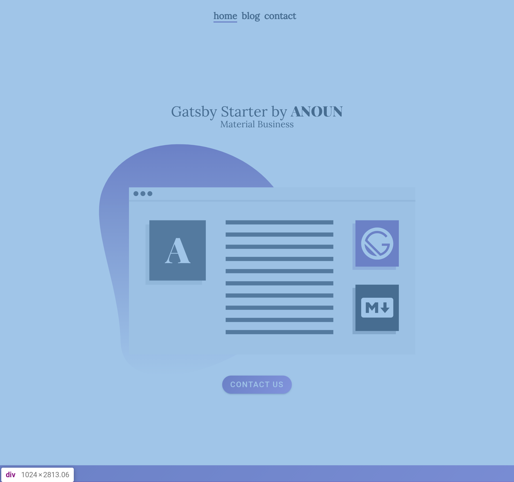

[](https://app.netlify.com/sites/gatsby-starter-material-business-markdown/deploys)

<p align="center">
  <a href="https://gatsby-starter-material-business-markdown.netlify.com" target="_blank">
    
  </a>
</p>

# Gatsby Starter by ANOUN | Material Business - Markdown

## Features

* [MDC React Components](https://github.com/material-components/material-components-web-react)
* [MDC Theming](https://material.io/develop/web/docs/theming/)
* Modern Design
* Home Page
* About Page
* Contact Page
  * [Formspark](https://formspark.io/) contact form
* Blog
  * Featured images for blog posts
  * Markdown post format
* SEO
  * Open Graph Tags
  * Dynamic Titles and Descriptions
  * Sitemap.xml
* Prettier code formatting
* CSS Fluid Typography
* PWA Support
* Google Analytics Support

## Coming Soon

* JSON LD Content
* Even easier customization (Typography.js, custom logo support, email, phone, social links across the site, etc.)
* Instructions for Setup (Blog post and a YouTube Tutorial)
* Pagination

## Performance Test

[View Lighthouse Test Results](https://lighthouse-dot-webdotdevsite.appspot.com/lh/html?url=https://gatsby-starter-material-business-markdown.netlify.com)

## Deploy to Netlify

[](https://app.netlify.com/start/deploy?repository=https://github.com/ANOUN/gatsby-starter-material-business-markdown)

## Customization

### Website Data

Edit `config/website.js`

```
module.exports = {
  // SEO
  title: "Gatsby Starter #1 | ANOUN | Markdown", // Navigation and Site Title
  titleTemplate: "%s · Gatsby Starter #1", // Template for Page Titles
  description: "This is Gatsby Starter #1 by ANOUN with content sourcing from Markdown files. Don't be shy, clone it on Github if you'd like!",
  siteUrl: "https://gatsby-starter-anoun-1-markdown.netlify.com", // Domain of your site. No trailing slash!
  image: "/images/anoun-share-image.png", // Used for SEO Share Image

  // Manifest
  icon: "src/favicon.png", // Used for manifest favicon generation
  short_name: "ANOUN", // shortname for manifest. MUST be shorter than 12 characters
  owner: "ANOUN", // Author
  theme_color: "#663399",
  background_color: "#ffffff",

  // Social and Analytics
  twitterUsername: "@anouncompany", // Twitter Username
  googleAnalyticsID: "", // Google Analytics Tag ID
}
```

### Theme

Edit `src/styles/theme.scss`

```
:root {
    --mdc-theme-primary: #663399;
    --mdc-theme-on-primary: #ffffff;
    --mdc-theme-secondary: #000000;
    --mdc-theme-on-secondary: #ffffff;
    --mdc-theme-surface: #fefefe;
    --mdc-theme-background: #ffffff;
    --mdc-theme-on-background: #000000;
}
```

### Typography

Edit `config/typography.js`

```
import Typography from "typography"

const typography = new Typography({
  title: "Gatsby Starter Material Business",
  baseFontSize: "18px",
  baseLineHeight: 1.666,
  headerFontFamily: [
    "Lora",
    "-apple-system",
    "BlinkMacSystemFont",
    "Segoe UI",
    "Roboto",
    "Helvetica",
    "Arial",
    "sans-serif",
    "Apple Color Emoji",
    "Segoe UI Emoji",
    "Segoe UI Symbol",
  ],
  bodyFontFamily: [
    "Lato",
    "-apple-system",
    "BlinkMacSystemFont",
    "Segoe UI",
    "Roboto",
    "Helvetica",
    "Arial",
    "sans-serif",
    "Apple Color Emoji",
    "Segoe UI Emoji",
    "Segoe UI Symbol",
  ],
  scaleRatio: 3.157,
  headerWeight: 400,
  overrideStyles: () => ({
    img: {
      marginBottom: 0,
    },
  }),
})

export default typography
```

## Credits

Designed by [ANOUN](https://anoun.company)

Made in Idaho

