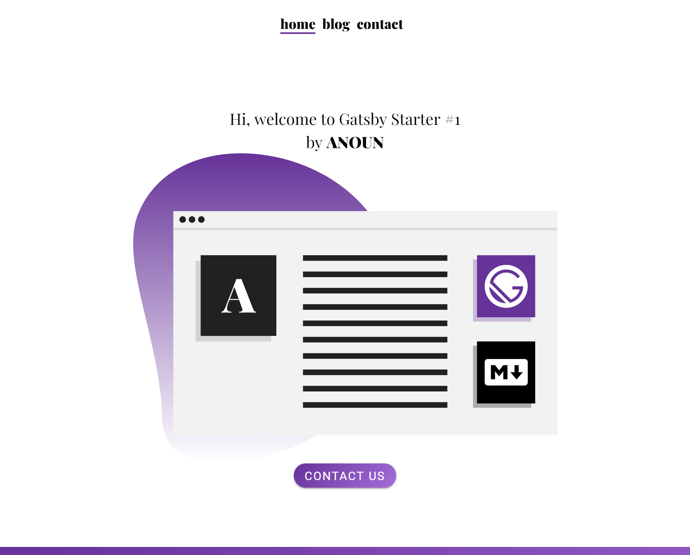

  

# Gatsby Starter by ANOUN #1 - Markdown

### Features

* [MDC React Components](https://github.com/material-components/material-components-web-react)
* MDC Theming
* Home Page
* About Page
* Contact Page
  * [Formspark](https://formspark.io/) contact form
* Blog
  * Featured images for blog posts
* SEO
* Prettier code formatting
* CSS Fluid Typography
* PWA Support
* Google Analytics Support

### Coming Soon

* About Page Markdown File
* Instructions for Setup (Blog post and video)
* JSON LD Content
